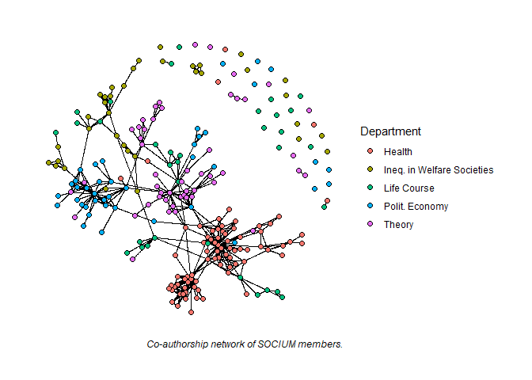

Testing WORCS
================
16 November, 2021

This manuscript uses the Workflow for Open Reproducible Code in Science
(Van Lissa et al. 2020) to ensure reproducibility and transparency. All
code <!--and data--> are available at
<https://github.com/christine-hvw/worcs_test>.

# The Socium Coauthorship Network

The data contains information on co-authorship in the [Socium research
center](https://www.socium.uni-bremen.de/) (University of Bremen)
between 2010 and 2020.

``` r
net_soc <- readRDS(here("data-processed", "net_soc.rds"))
```

## Department Assortativity

Let’s inspect with plot whether co-authorship tends to be more prevalent
within than across departments:

``` r
ggraph(net_soc, layout = "fr") +
  geom_edge_link() +
  geom_node_point(aes(fill = as.factor(dep_cat)), 
                  shape = 21, size = 2) +
  labs(fill = "Department", caption = "Co-authorship network of SOCIUM members.") +
  theme_graph(base_family="sans")
```



Apart from a visual inspection, we can also calcualte the assortativity
coefficient[1]:

``` r
assort_coef <- net_soc %>% 
  activate(nodes) %>% 
  mutate(assort = graph_assortativity(dep_cat, directed = FALSE)) %>% 
  pull(assort) %>% 
  unique()
```

The coefficient for department assortativity is **0.842**, meaning:
co-authorship is far more prevalent within than between departments.

<div id="refs" class="references csl-bib-body hanging-indent">

<div id="ref-newman2003" class="csl-entry">

Newman, M. E. J. 2003. “Mixing Patterns in Networks.” *Physical Review
E* 67 (2): 026126. <https://doi.org/10.1103/PhysRevE.67.026126>.

</div>

<div id="ref-vanlissaWORCSWorkflowOpen2020" class="csl-entry">

Van Lissa, Caspar J., Andreas M. Brandmaier, Loek Brinkman, Anna-Lena
Lamprecht, Aaron Peikert, Marijn E. Struiksma, and Barbara Vreede. 2020.
“WORCS: A Workflow for Open Reproducible Code in Science,” May.
<https://doi.org/10.17605/OSF.IO/ZCVBS>.

</div>

</div>

[1] I use the assortativity coefficient for discrete characteristics as
proposed by Newman (2003), which takes the value 0 when there is no
assortative mixing and 1 when there is complete assortativity.
